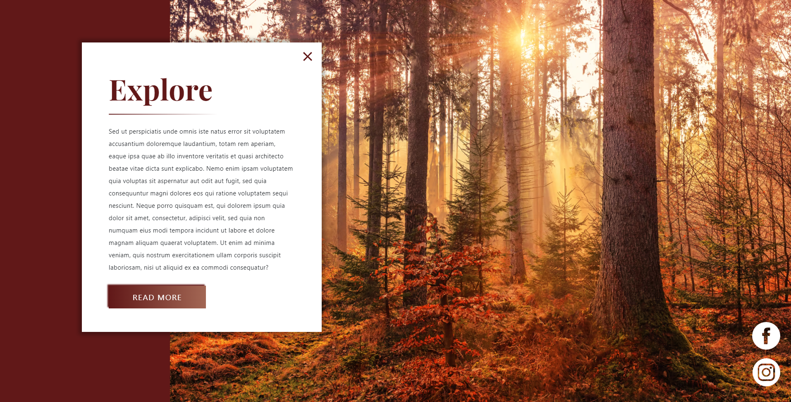

# Udundi Interview Project

This is my entry for the  [Udundi Explore Page](https://zacherymorgan.github.io/Udundi-Project/).

## Table of contents
- [Screenshot](#screenshot)
- [Links](#links)
- [Built with](#built-with)

### Screenshot

### Links

- Live Site URL: [zacherymorgan.github.io/Udundi-Project](https://zacherymorgan.github.io/Udundi-Project/)

### Built with

- Semantic HTML5 markup
- SCSS
- JavaScript
- Flexbox
- Bootstrap
- Script to check for browser compatibility with AVIF images
- Mobile Responsiveness
